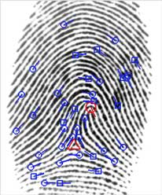

  Currently, I am working with Assistant Professor of Statistics, Amanda Luby,
  as well as four of my peers Thomas Daillak, Sherry Huang, Horace Shew, and
  Alyssa Zhang on forensic statistics research.
  
```{r setup, include=FALSE}
knitr::opts_chunk$set(echo = FALSE)
library(knitr)
library(graphics)
library(bookdown)
```

```{r,fig.align='center', out.width = "30%"}


  


```
  **General Background**
  
  Finger print analysts are making complex decisions when matching or not 
  matching exemplar and latent prints. Latent prints are unintentional prints 
  found on crime scenes while exemplar prints are taken under controlled 
  conditions. In a real life situation, an analysts would receive a latent 
  print and assess it for value. If a print has value, it is then compared to 
  one or multiple exemplar prints to determine whether or not the there is a 
  match.
  
  
  
   **Project Overview**
  
  Item Response Theory (IRT) can be utilized to model the decisions of analysts 
  to predict the probability of a correct response given the examiner's 
  proficiency and the difficulty of the match. Bayesian statistics is utilized 
  to update models with prior data to improve these predictions.